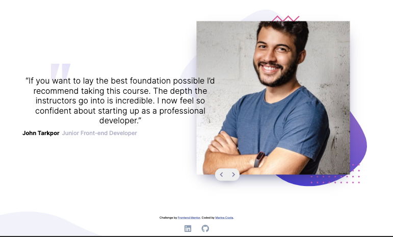
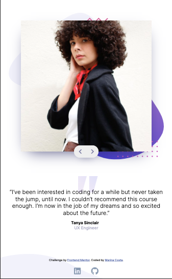

<h1 align="center">Frontend Mentor - Coding Bootcamp Testimonials Slider</h1>

- I created this landing page based on the [Frontend Mentor - Coding Bootcamp Testimonials Slider](https://www.frontendmentor.io/challenges/coding-bootcamp-testimonials-slider-4FNyLA8JL/intro) design.

## Overview

## Goals

- The challenge was to build out this testimonial slider and get it looking as close to the design as possible.

- The users should be able to: 
  - View the optimal layout for the component depending on their device's screen size
  - Navigate the slider using either their mouse/trackpad or keyboard

## How to use it

- Download the files and open `index.html` on the browser.

## References and resources

* [Frontend Mentor](https://www.frontendmentor.io/challenges/coding-bootcamp-testimonials-slider-4FNyLA8JL/intro)
* [MDN Documentation](https://developer.mozilla.org/en-US/)
